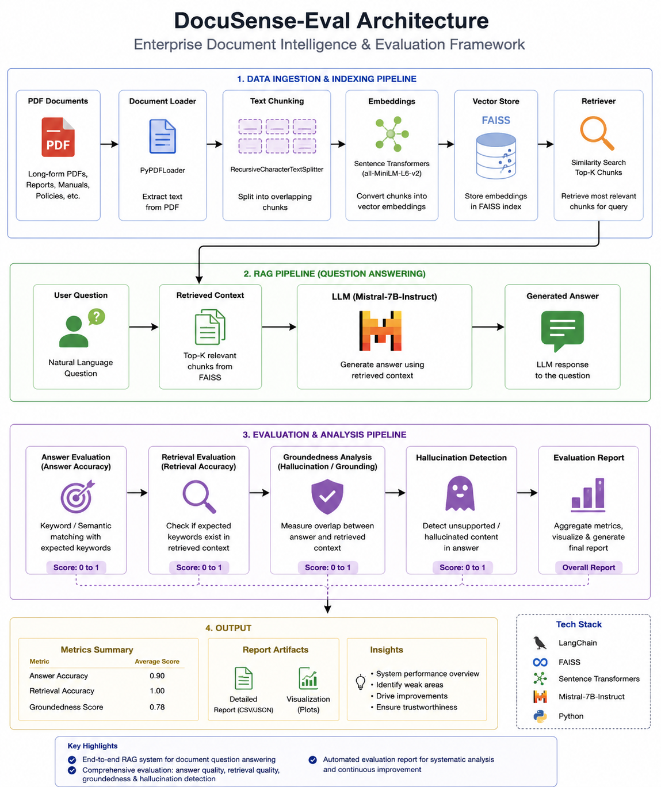
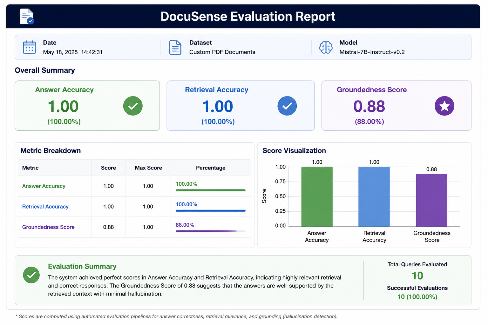

# 📄 DocuSense-Eval

### Enterprise Document Intelligence & Evaluation Framework

> A Retrieval-Augmented Generation (RAG) system for document question answering with automated retrieval evaluation, groundedness analysis, and hallucination detection.


---

## 🚀 Overview

DocuSense-Eval is an enterprise-style document intelligence system that transforms long-form PDF documents into a searchable knowledge base and generates grounded answers using Large Language Models.

Unlike traditional RAG chatbots, DocuSense-Eval incorporates automated evaluation pipelines to assess retrieval quality, answer correctness, and hallucination risk.

The framework combines:

* 📚 Document Ingestion
* 🔍 Semantic Retrieval
* 🤖 LLM-Powered Question Answering
* 📊 Evaluation & Failure Analysis

---

## ✨ Key Features

### 📄 Document Intelligence

* PDF ingestion and parsing
* Recursive text chunking
* Semantic document indexing
* Context-aware retrieval

### 🔍 Retrieval-Augmented Generation (RAG)

* FAISS Vector Database
* Sentence Transformer Embeddings
* Top-K Context Retrieval
* Dynamic Prompt Construction

### 🤖 LLM-Powered Question Answering

* Mistral-7B Instruct
* Context-Grounded Responses
* Retrieval-Aware Prompting

### 📊 Evaluation Framework

* Answer Accuracy Evaluation
* Retrieval Accuracy Evaluation
* Groundedness Analysis
* Hallucination Detection
* Automated Evaluation Reports

---

## 🏗️ System Architecture



### Pipeline

```text
PDF Documents
      ↓
Document Loader
      ↓
Text Chunking
      ↓
Sentence Transformers
      ↓
FAISS Vector Store
      ↓
Retriever
      ↓
Mistral-7B
      ↓
Answer Generation
      ↓
Answer Evaluation
      ↓
Retrieval Evaluation
      ↓
Groundedness Analysis
      ↓
Hallucination Detection
      ↓
Evaluation Report
```

---

## 📈 Evaluation Dashboard



### Sample Results

| Metric             | Score |
| ------------------ | ----- |
| Answer Accuracy    | 1.00  |
| Retrieval Accuracy | 1.00  |
| Groundedness Score | 0.88  |

---

## 🧠 Why DocuSense-Eval?

Most RAG systems stop at generating answers.

DocuSense-Eval goes further by answering critical enterprise AI questions:

* Did the retriever fetch relevant information?
* Is the answer grounded in retrieved context?
* Is the model hallucinating?
* How reliable is the system overall?

This makes the framework useful for building trustworthy document intelligence systems.

---

## 🛠️ Tech Stack

| Category            | Technology                  |
| ------------------- | --------------------------- |
| Language            | Python                      |
| LLM                 | Mistral-7B Instruct         |
| Framework           | LangChain                   |
| Vector Store        | FAISS                       |
| Embeddings          | Sentence Transformers       |
| Document Processing | PyPDF                       |
| ML Framework        | Hugging Face Transformers   |
| Evaluation          | Custom Evaluation Framework |

---

## 📂 Project Structure

```text
DocuSense-Eval/
│
├── notebooks/
│   └── DocuSense_Eval.ipynb
│
├── images/
│   ├── architecture.png
│   └── evaluation_report.png
│
├── requirements.txt
│
├── README.md
│
└── LICENSE
```

---

## ⚙️ Installation

```bash
git clone https://github.com/<your-username>/DocuSense-Eval.git

cd DocuSense-Eval

pip install -r requirements.txt
```

---

## 🎯 Example Query

### User Question

```text
What is the Transformer architecture?
```

### Retrieved Context

```text
The Transformer model relies entirely on self-attention mechanisms and removes recurrence entirely.
```

### Generated Answer

```text
The Transformer architecture replaces recurrence with self-attention mechanisms and consists of encoder-decoder stacks.
```

---

## 📊 Evaluation Components

### Answer Accuracy

Measures how well generated responses align with expected information.

### Retrieval Accuracy

Evaluates whether relevant document chunks were retrieved.

### Groundedness Analysis

Measures how strongly generated answers are supported by retrieved evidence.

### Hallucination Detection

Flags unsupported information that does not appear in the source context.

---

## 🔮 Future Improvements

* Multi-document Retrieval
* Hybrid Search (BM25 + Dense Retrieval)
* LLM-as-a-Judge Evaluation
* Interactive Dashboard
* Multi-Modal Document Understanding
* Production Deployment Pipeline

---

## 👨‍💻 Author

**Sandeep**

M.Tech in Data Science & AI

Indian Institute of Technology Tirupati

---

### ⭐ If you found this project interesting, consider giving it a star!
